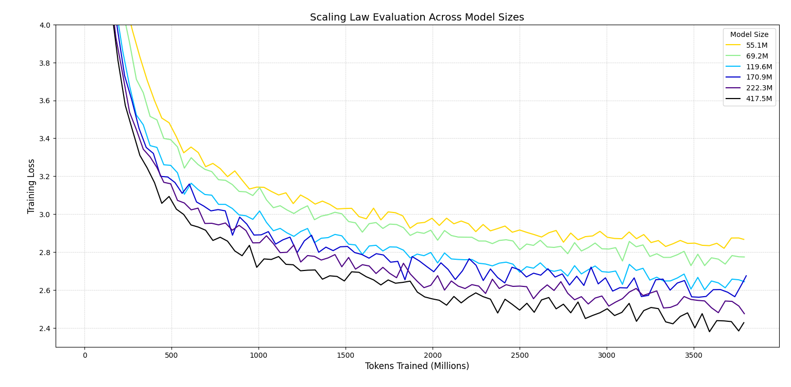
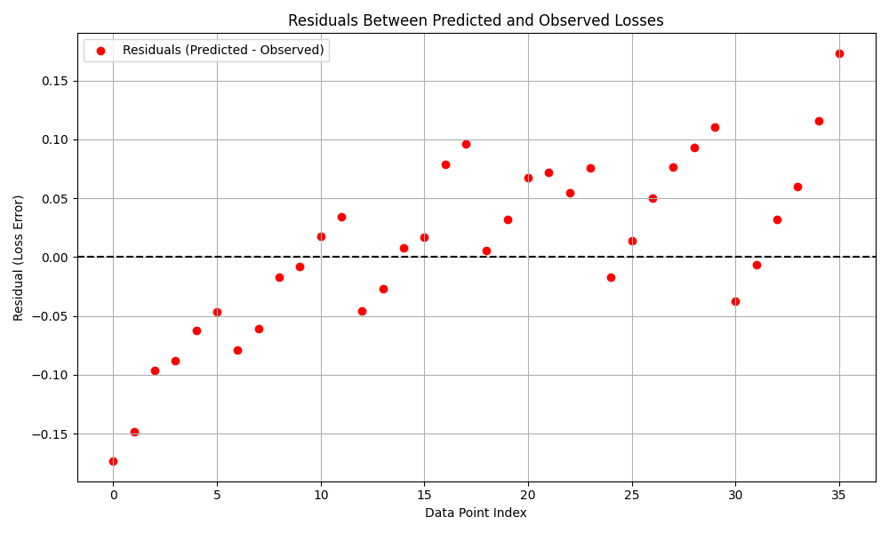
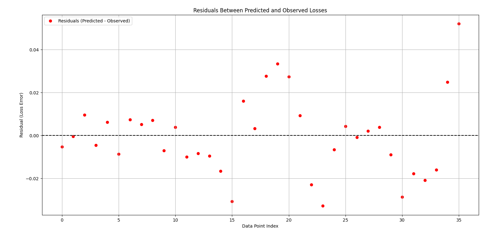
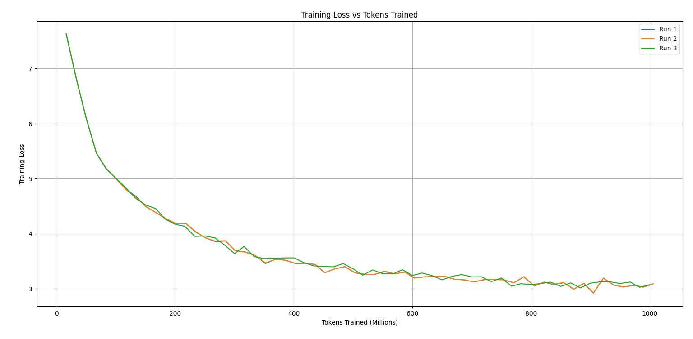
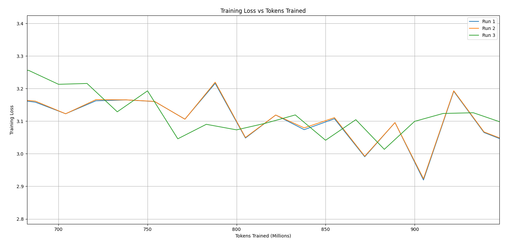
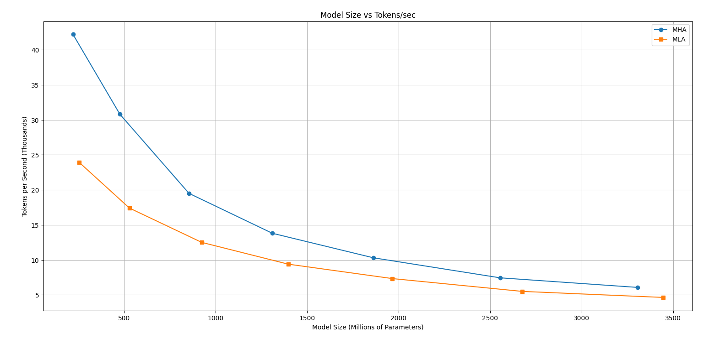

# SimpleLLaMA: LLaMA Architecture Based Transformer Model with MLA, LoRA, Speculative Decoding, and Full Training Pipeline


## Table of Contents

- [Overview](#overview)
- [Disclaimer](#disclaimer)
- [Core Features](#core-features)
- [Project Roadmap](#project-roadmap)
- [How To Use](#how-to-use)
  - [TLDR](#tldr)
- [Model Architecture](#model-architecture)
  - [Transformer Architecture (Decoder-Only)](#transformer-architecture-decoder-only)
  - [Component Details](#component-details)
- [Dataset](#dataset)
  - [Supervised Fine-Tuning (SFT) Dataset](#supervised-fine-tuning-sft-dataset)
- [Scaling Laws](#scaling-laws)
    - [Parameter/Token Sweep Setup](#parametertoken-sweep-setup)
    - [Notes](#notes)
    - [Procedure](#procedure)
    - [Results](#results)
- [Training Phase](#training-phase)
  - [Pretraining](#pretraining)
  - [Supervised Fine-Tuning (SFT)](#supervised-fine-tuning-sft)
  - [RLHF (Planned)](#rlhf-planned)
- [Benchmarks](#benchmarks)
- [LoRA Fine-Tuning](#lora-fine-tuning)
- [Speculative Decoding](#speculative-decoding)
- [Custom Model Training](#custom-model-training)
- [Additional Observations](#additional-observations)
  - [Checkpoint Validation](#checkpoint-validation)
  - [MHA vs MLA](#mha-vs-mla-throughput-comparison)
- [License](#license)
- [Author](#author)
- [Acknowledgements](#acknowledgements)


---

## Overview

SimpleLLaMA is a modular implementation of the LLaMA-style decoder-only transformer architecture, designed for pretraining from scratch on large web datasets. 
It supports Multi-head Latent Attention (MLA), LoRA fine-tuning, and speculative decoding for accelerated inference.

The project includes scaling law analysis, full training utilities, a CLI-based inference system, among other features. 
Built with flexibility in mind for research and experimentation purposes.

> This is a **personal research project** out of my interest in Large Language Models

---

## Disclaimer

SimpleLLaMA is a language model that's trained without any refusal dataset or alignment constraints. 
As such, the resulting models may generate outputs that are inappropriate, offensive, or otherwise unsafe in certain contexts if prompted by the user.

- These weights are intended for research and educational purposes only.
- Model access is gated on Hugging Face under an access agreement requiring acceptance of these risks.
- The base code in this repository is MIT-licensed, but **model weights are hosted separately** and subject to Hugging Face's terms of use and the access gate.

Use responsibly. The author is not liable for downstream misuse or harm caused by these models.


---

## Core Features

| Feature                                  | Description |
|------------------------------------------|-------------|
| **MLA**                                  | Multi-head Latent Attention mechanism that splits key/query heads into content + positional parts and uses LoRA-style low-rank projections |
| **RoPE**                                 | Rotary Positional Embeddings applied to Q/K heads for encoding position without fixed embeddings |
| **LoRA Integration**                     | Lightweight adaptation for fine-tuning |
| **Tokenizer**                            | HuggingFace `tokenizers` with ByteLevel decoder support |
| **Training System**                      | Token-based checkpointing, scaling law support, manual learning rate scheduling |
| **Evaluation**                           | Few-shot prompt evaluation + manual `.generate()` for training insight |
| **Inference CLI**                        | Terminal interface with token sampling configs and streaming generation |
| **Speculative Decoding (planned)**       | Fast decoding using a draft + target model scheme |
| **DPO Reinforcement-Learning (planned)** | Direct Preference Optimization to replace PPO-based alignment |

---

## Project Roadmap

- ✅ Core LLaMA-style transformer architecture
- ✅ Custom training logger, checkpoint manager, optimizer scheduler
- ✅ MLA (Multi-head Latent Attention)
- ✅ Add LoRA modules
- ✅ Token-based pretraining + scaling law framework
- ✅ Create and test supervised fine-tuning (SFT) scripts on pretrained models
- ❌ Implement CLI inference interface with streaming and config flags
- ❌ Add model benchmarking script for evaluation
- ❌ Implement and experiment with Direct Preference Optimization (DPO)
- ❌ Incorporate speculative decoding support for fast inference
- ❌ Pretrain ~273M parameter model on FineWebEdu as the Draft Model for Speculative Decoding (12.5B Tokens)
- ❌ Pretrain ~1.3B parameter model on FineWebEdu (50B Tokens)
- ❌ Finetune pretrained model on custom dataset
- ❌ Apply Reinforcement Learning to Model
- ❌ Release full model weights along with any LoRA adapters

---

## How To Use
<Instructions on how to use the model, including downloading from HF, placing files in correct folders, and modifying the config file>
<Include directions on how to use with custom CLI and with OpenWebUI (If that's possible, else might need to create it manually?)>
<Include notes to run absolute runs, E.g. cd into SimpleLLaMA then run from there, like python3 simple_llama/inference/cli.py due to package structure>
< for example py -m simple_llama.finetune.ft_test1>
<Not mering lora weights>
Need to run 'pip install -e .' if want to run without full qualifications


### TLDR

<TLDR section for the above, probably just download one of the basic models, and load it in to directly use?>

---

## Model Architecture

### Transformer Architecture (Decoder-Only)

- **Input Tokens**
  - ↓
- **Embedding Layer**
  - Convert tokens to n_embd-dimensional vectors
  - ↓
- **Rotary Positional Embeddings**
  - Precomputed complex sinusoidal frequencies applied per-head
  - ↓
- **[DecoderBlock x N]**
  - ├─ RMSNorm (PreNorm applied to input)
  - ├─ **Attention Layer (One of):**
  - │   ├─ Multi-Head Self-Attention (MHA)
  - │   │   ├─ Optional LoRA Layer Injection
  - │   │   ├─ Standard QKV projection
  - │   │   └─ RoPE applied to Q/K
  - │   └─ Multi-Head Latent Attention (MLA)
  - │   │   ├─ Queries split into content (no-pos) and positional (RoPE) heads
  - │   │   ├─ Optional LoRA Layer Injection
  - │   │   ├─ Key split, with low-rank decomposition
  - │   │   ├─ Apply RMSNorm
  - │   │   └─ Final RoPE application
  - ├─ Residual Connection
  - ├─ RMSNorm (PreNorm applied to attention output)
  - ├─ **FeedForward Layer**
  - │   ├─ Two-layer MLP
  - │   ├─ SiLU activation with gated product
  - │   └─ Hidden size = 4 * n_embd * 2/3 (rounded to power-of-two multiple)
  - └─ Residual Connection (Adds attention output to FFN output)
  - ↓
- **Final RMSNorm**
  - ↓
- **Linear Output Projection**
  - Projects back to vocabulary size for logits


### Component Details

- **Embedding Layer**: Standard learnable token embeddings
- **Rotary Positional Encoding (RoPE)**: Precomputed using a `theta` base and cached for efficient reuse
- **DecoderBlock**: Core transformer block with attention and feedforward sublayers. Choice of attention is controlled via a `use_mla` flag.
- **Attention (MHA or MLA)**:
  - **MHA**: Implements causal self-attention using QKV projections and optional FlashAttention.
  - **MLA**: A more sophisticated mechanism adapted from DeepSeek, where:
    - Q and K are split into positional and content heads.
    - Low-rank decomposition is used to compress K and V.
    - Rotary embeddings applied only to positional dimensions.
    - Optional FlashAttention if supported
- **FeedForward Layer**: Two-layer MLP with SiLU activation and a multiplicative gating mechanism, similar to LLaMA's FFN. 
- **RMSNorm**: Used instead of LayerNorm, stabilizes training by re-scaling activations without centering.
- **Final Linear Layer**: Maps the hidden representation back to the vocabulary logits for language modeling.


<Should mention the configs for Final/SpecDec model>

---

## Dataset

The dataset used to train the model is HuggingFace's **FineWebEdu**, filtered to retain only ASCII character samples. 
Due to compute limitations, a smaller, English-only corpus was preferred over a multilingual dataset, with the goal of producing a more competent language model under constrained resource budgets.

Each text sample was categorized into one of two classes based on character count:

- **Short**: Fewer than 7,500 characters  
- **Medium**: Between 7,500 and 12,000 characters

Although the initial plan was to pretrain at a sequence length of 4096 tokens, the quadratic compute cost of attention with respect to sequence length made this somewhat difficult to proceed.
Instead, a progressive sequence length training approach was used. 
The model will first be trained at a fixed `seq_len=2048` for the first 90% of the token budget to focus on learning core syntactic and structural patterns. 
The final 10% will be trained using `seq_len=4096`, and swapping out the `Short` dataset with `Medium`

To avoid biasing the model toward overly long sequences near the end of training, **intentional category leakage** was introduced:
Where 10% of *short* samples are randomly upsampled into the *medium* category.

This was designed to better reflect real-world usage, where the majority of user queries are relatively short, unless copying/pasting long-form text/documents. 
Blending in shorter examples during long-sequence training may reduce context-length overfitting.

In total, the ASCII-filtered FineWebEdu corpus is estimated to contain approximately **50 billion tokens** after tokenization  
(Using the observed conversion rate of ~3.9 characters per token). Based on the training split:

- **~45B tokens** with `seq_len=2048`  
- **~5B tokens** with `seq_len=4096`


### Supervised-Fine-Tuning (SFT) Dataset
For the Supervised-Fine-Tuning (SFT) stage, I have created a custom dataset using LLMs like DeepSeek and Gemini. 
This dataset is structured using "User"/"Assistant" model, to guide the text-continuation behavior of a pretrained model into a more chat-like conversation format. 
There are many different categories within this dataset, among with includes subsets such as: 
- Instruction Following
- Multi-Turn Dialogue
- Simple Reasoning Logic
- Factual QA
- Error Correction
- Long Sequence Generation

Among many others. 

In total, there is approximately 220k examples in this custom SFT dataset.
I am planning to possibly introduce external, open-sourced, datasets such as `digitalpipelines/wizard_vicuna_70k_uncensored`. 
That remains to be seen. 

---

## Scaling Laws

After reading the paper, “Training Compute-Optimal Large Language Models” by Hoffman et al., I became interested in applying their empirical scaling law framework to this project.
In order to estimate training behavior of the final model, a series of models were trained following the empirical scaling law framework from the paper. 
The goal was to empirically fit loss curves based on parameter count (N) and number of training tokens (D), and derive the constants `A` and `B` in the following relation:

```
L(N, D) = c + A / N^α + B / D^β
```

Using their original constants:

```
L(N, D) = 1.69 + A / N^0.34 + B / D^0.28
```

This loss equation helps estimate the expected training loss for any combination of model size and dataset size and is useful for selecting a model scale that matches a fixed FLOP budget.

### Parameter/Token Sweep Setup

To generate the loss surface, six model scales were selected, each paired with a training token budget approximately 1.5x larger than the previous. 
Exact parameter counts vary due to architectural constraints (e.g., n_embd should have large factor of 2's, layer count must be an integer), but spacing was maintained as closely as feasible.

| Nominal Params | Actual Params | n_embd | n_heads | n_layers |
|----------------|---------------|--------|---------|----------|
| 50M            | 55.1M         | 768    | 12      | 6        |
| 75M            | 69.2M         | 768    | 12      | 8        |
| 112M           | 119.6M        | 1024   | 16      | 8        |
| 170M           | 170.9M        | 1024   | 16      | 12       |
| 250M           | 222.3M        | 1024   | 16      | 16       |
| 380M           | 417.5M        | 1280   | 20      | 20       |


### Notes:
- Actual parameter counts include embeddings and all layer weights.
- The spacing of token budgets is logarithmic, with each step approximately 1.5x the previous one.
- While 1.5x parameter scaling is theoretically ideal, rounding constraints in n_embd and layer count introduce slight deviations.

### Procedure:
- Each model was trained up to 3.8B tokens
- Each model's loss is recorded at [0.5, 0.8, 1.3, 1.7, 2.5, 3.8] billion token intervals resulting in 36 data points
- These losses were fit to extract the `A` and `B` constants in the scaling law equation.
- The resulting fit was used to estimate the expected loss at larger scales and guide the setup for the ~1B parameter model.


### Results:
**Training Loss of the 6 Test Models**:
<p align="center">
  
</p>


Fitting the 36 points with fixed exponents (`α=0.34`, `β=0.28`) produced:

```
A = 230.307  
B = 288.669
```

Predicted final loss for the target setup:
- Model: ~1.3B parameters
- Tokens: 50B  
- Predicted Loss: 2.167

However, this is a notable deviation from my original expectation. 
Based on personal estimate through observing model behavior and training loss, it would likely be in the range of [1.90, 2.00]

To confirm my suspicions, I plotted the residual losses, calculated as `predicted_loss - observed_loss` using the 36 datapoints. 
The result was a clear trend that as the model/dataset size increases, so does the residual. 
Therefore, I believe it's valid that the model is overestimating the final loss. 

<p align="center">
  
</p>

I went back and decided to fit all 5 values, c, alpha, beta, A, and B
which resulted in the prediction of a final loss being 2.101. 
That is still higher than my expected final loss, but closer than the initial prediction. 

Residual graph is as follows: 

<p align="center">
  
</p>

Where the datapoints are much more symmetrically distributed around 0, though an upward trend does seem to slightly emerge near the end. 

While the prediction is imperfect, this analysis did provide me insight on this topic. 


*(I would strongly recommend reading the original paper for deeper insight — this summary leaves out many details and derivations.)*

---

## Training Phase

This project is structured around a three-phase training pipeline: 
pretraining a foundational language model from scratch, supervised fine-tuning (SFT), and preference-based alignment via reinforcement learning (RLHF/DPO). 
Each phase is modular and isolated to ensure reproducibility, flexibility, and controlled experimentation. 


### Pretraining

The base model is trained from scratch using a causal language modeling objective to learn general-purpose representations from high-quality web text.

- **Objective**: Next-token prediction with `CrossEntropyLoss`, using left-to-right causal masking.

- **Dataset**:
  - Source: ASCII-filtered **FineWebEdu** corpus.
  - Format: Tokenized `.npy` shards streamed in batches without full memory load.
  - Curriculum: Sequence length increases over training — 90% of tokens at `seq_len=2048`, 5% at `4096`, 5% at `8192`.
  - No val split (streaming-only training)

- **Model Architecture**:
  - LLaMA-inspired decoder-only transformer.
  - Supports both **Multi-Head Attention (MHA)** and **Multi-head Latent Attention (MLA)**.
  - Rotary positional embeddings (RoPE), RMSNorm, SiLU-based feedforward gating, and optional FlashAttention.
  - Configurable head splitting, LoRA ranks, and residual design.

- **Training Configuration**:
  - **Gradient Accumulation**: Simulates large updates (e.g., 512k tokens/update) using small per-GPU batch sizes.
  - **Optimizer**: `AdamW` with `fused=True` if hardware allows.
  - **Scheduler**: Manually implemented warmup followed by cosine decay. All state is checkpointable.
  - **Precision**: Uses `torch.autocast` with `bfloat16` when available. Fallback to `fp32` if needed.
  - **Compilation**: `torch.compile()` used to JIT the model for reduced runtime overhead.
  - **Gradient Clipping**: Applied per optimization step to avoid instability at large batch sizes.
  - **Checkpointing**:
    - Frequency: Every X tokens processed (e.g., every 50M tokens), determined by `token_ckpt` parameter in `config.py` file.
    - Includes model state, optimizer, scheduler, dataset indices, and hyperparameters.
    - Checkpoints are named using token count and recent loss for clarity.

- **Logging and Evaluation**:
  - Logs include training loss, perplexity, learning rate, token throughput, and gradient norm.
  - CSV-format logs written every evaluation interval for ease of plotting and post-hoc analysis.
  - Evaluation prompts (`few_shot_prompts`) are sampled with decreasing frequency as training progresses.
    - This balances qualitative insight with performance cost.
    - Sampling is controlled by a decaying `m` parameter (e.g., every 10th to 100th eval interval).
  - `.generate()` uses top-p/temperature sampling to produce completions from custom prompts.

- **Scaling Law Evaluation**:
  - <Write down if the training loss curve for this base model matches that of expectation from test runs!>


<Note down time taken, type/number of GPU used, and other observations!>
<Talk about configs used? Like 2048 n_embd, x layers, x head, and such. Also, tokens per udpate step achieved via grad accum>
<Insert image of training loss>

---

### Supervised Fine-Tuning (SFT)

After pretraining, the base model will undergo full-parameter finetuning, based on supervised instruction-response datasets.

- **Objective**: Continue language modeling under supervision, optimizing for instruction-following behavior.
- **Datasets**: TBD, supports integration of open-source instruction datasets like Alpaca or domain-specific corpora.
- **Loss**: Still `CrossEntropyLoss`, but focused on supervised paired samples (e.g., user → model).
- **Extended Context**:
  - Supports longer contexts via positional frequency extension.
  - May expand `max_seq_len` from 2k → 4k/8k during SFT.
- **Hyperparameters**:
  - Min/Max LR and Scheduler remains the same
  - Dropout increased to improve generalization (From 0.0 → 0.1).
  - Likely be trained for a few epochs
- **LoRA (Optional, used for further custom finetuning)**: 
  - Low-rank adapters can be injected at Q/V projections only.
  - Enables SFT with minimal parameter updates (~[0.1, 1.0]% of total weights).
  - LoRA weights are saved separately for downstream loading.

---

### RLHF (Planned)

The third phase involves aligning the model to human preferences using preference-based methods (DPO is the current plan). 
This is intended to improve helpfulness and align to human-preferred tones/language without degrading core language abilities.

Approach/Pipeline/Plans- TBD

---

## Benchmarks

<Pretrain benchmarks, need any for SFT/RLHF?>


---


## LoRA Fine-Tuning

< Talk about LoRA>


---

## Speculative Decoding
- **Purpose**: Speed up inference by combining a lightweight draft model with a larger target model.
- **Mechanism**:
  - Draft model proposes several tokens in parallel.
  - Target model verifies or rejects predictions, reverting if needed.
- **Implementation Plan**:
  - Reuse same tokenizer and embedding dimensions between models.
  - Use cached KV pairs to avoid recomputation during rejection.

<Add other info like training dataset, training loss, how well it fits the scaling law and such>

---

## Custom Model Training

<Talk about how to train a custom model using my pipeline?>


---

## Additional Observations

### Checkpoint Validation

One feature in this project is the ability to checkpoint the model during pretraining, in case of an unforeseen accident that interrupts training.  
To verify that it works correctly, I trained a 119.6M parameter model on a 1B token dataset three times. In each run, I kept all configurations exactly the same to the best of my ability — most importantly, the random seed.

- The **first run** is just to observe how the model trains under normal conditions.  
- The **second run** is a sanity check to make sure that it behaves almost identically to the first one.  
- The **third run** is where I test checkpointing. I saved a checkpoint every 100M tokens and resumed training from that checkpoint each time.

So in Run 3:
- Trained from 0 → 100M tokens, saved checkpoint, halted training.
- Loaded checkpoint, continued from 100M → 200M.
- Repeated this all the way to 1B, making 9 checkpoint loads total.

Here's the result:

<p align="center">
  
</p>

At first glance, it looks like only two runs were plotted — which is expected. Run 1 and Run 2 should overlap almost perfectly, and that's what happened.

To confirm this, here's a zoomed-in version near the final stages of training:

<p align="center">
  
</p>

As one can see, Run 2 (blue line) is just barely visible underneath Run 1 (orange line).
I believe the differences come from floating point error, which doesn't really affect the end result in practical cases.

Overall, the checkpointing does seem to work as intended. 
The model resumes correctly, loss trajectory stays consistent, and training convergence isn't affected.

The only real difference is that the third run (with checkpoints) has a slightly different loss curve.
I suspect the reason why they differ during training is due to the usage of gradient accumulation, where sometimes the model reaches the token-count checkpoint but haven't stepped the optimizer using the accumulated gradients. 

Although the training losses differ somewhat, the end result was close enough to an acceptable degree. 


### MHA vs MLA Throughput Comparison

Although this project includes a full implementation of Multi-head Latent Attention (MLA) based on the DeepSeek-V3 Technical Report, it is not used during pretraining or SFT, primarily due to throughput inefficiencies at smaller model scales.

While MLA may offer certain architectural advantages such as low-rank key/value compression, its computational cost is higher than standard Multi-head Attention (MHA) in practice.

I tested both MHA and MLA across multiple model sizes on an A100 PCIe GPU, with the results plotted below:

<p align="center">
  
</p>

As shown in the plot, MLA remains consistently slower than MHA across all model sizes tested (Up to around 3.4B parameters).
My guess is that there are additional computation overheads caused by MLA (E.g. tensor decomposition, concatenation, many smaller matmul, etc.,) where DeepSeek directly address that by implementing and using custom, optimized, kernels for better efficiency. 

However, the performance gap does seem to narrow as model size increases, suggesting possibility better scalability when using MLA.
For small-to-mid scale models, though, MHA remains the practical default (Which is the one used in this project)

(The above was measured using a batch size of 1 and sequence length of 512. Throughput will differ across various configurations/devices)

---

## License

This project is licensed under the **MIT License**.  
Feel free to use, extend, or adapt it for research or application purposes.

---

## Author

**Ivan Cao**  
Senior CS Student | University of Mississippi  
Open to collaboration and research questions.  
GitHub: [https://github.com/IvanC987/](https://github.com/IvanC987/)

---

## Acknowledgements

This project was inspired by LLaMA, DeepSeek, and various other open source Large Language Models

Papers: 
- [LLaMA: Open and Efficient Foundation Language Models (Meta)](https://arxiv.org/abs/2302.13971)
- [DeepSeek-V3 Technical Report](https://arxiv.org/abs/2412.19437)
- [Training Compute-Optimal Large Language Models](https://arxiv.org/abs/2203.15556)
- [LoRA: Low-Rank Adaptation of Large Language Models](https://arxiv.org/abs/2106.09685)
- [Accelerating Large Language Model Decoding with Speculative Sampling](https://arxiv.org/abs/2302.01318)
- [RoFormer: Enhanced Transformer with Rotary Position Embedding](https://arxiv.org/abs/2104.09864)

Videos:
- [Umar Jamil's 'Coding LLaMA 2 from scratch in PyTorch' Video](https://www.youtube.com/watch?v=oM4VmoabDAI)
- [Dr. Karpathy's 'Let's reproduce GPT-2 (124M)' Video](https://www.youtube.com/watch?v=l8pRSuU81PU)

Much of the implementation also borrows design clarity from these excellent open-source efforts.

---
