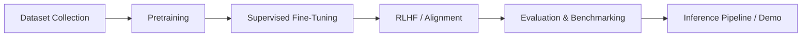

# SimpleLLaMA: A Sandbox for Understanding LLM Training

SimpleLLaMA is an educational project that reproduces the training pipeline of a modern large language model (LLM) at a smaller, manageable scale. Unlike black-box APIs, this project provides a transparent, step-by-step view into pretraining, supervised fine-tuning, alignment, and evaluation.

## Sections
- [Pretraining](pretraining/overview.md)
- [Supervised Fine-Tuning](sft/overview.md)
- [Reinforcement Learning / Alignment](rlhf/overview.md)
- [Miscellaneous (Benchmarking, Inference, Notes)](misc/benchmarking.md)

Disclaimer- This documentation is created with the best of my abilities. Further proof reads were done manually, followed by review of a LLM to verify accuracy. That said, there many still be some slightly inaccuracies present. 

