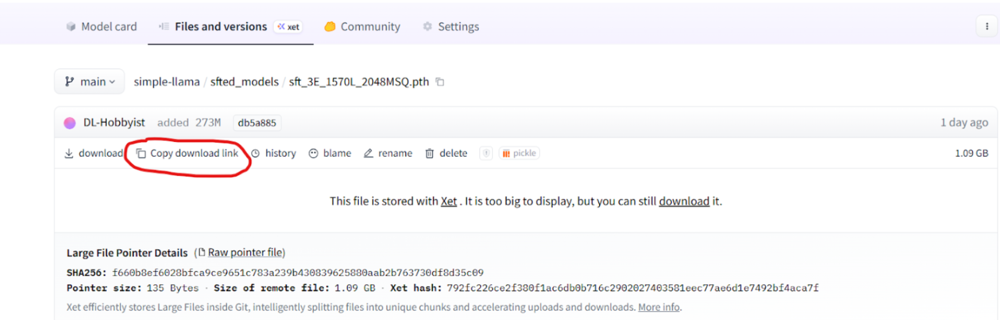

# Inference

This section provides a guide for running SimpleLLaMA inference using pre-trained or fine-tuned model checkpoints. Unlike the training
stages, inference is lightweight and can be performed on consumer hardware with minimal setup.

Whether you want to experiment with the model's conversational capabilities, test different sampling strategies, or integrate SimpleLLaMA into your
own applications, this guide covers everything needed to get started.

---
## 1. Overview

SimpleLLaMA supports interactive inference through a command-line interface that:

- Loads pre-trained or fine-tuned model checkpoints
- Supports multiple sampling methods (greedy, top-k, top-p)
- Provides runtime configuration for temperature, max tokens, and system prompts
- Maintains conversation history for multi-turn dialogues (when using SFT models)
- Streams generated tokens in real-time

Pre-trained models are available in 273M parameter and 1.3B parameter models.

Fine-tuned (SFT) models are instruction-aligned versions of the pretrained models, optimized for conversational and task-oriented interactions.

---
## 2. System Requirements

Hardware Requirements

| Component  | Minimum                                   | Recommended                |
|------------|-------------------------------------------|----------------------------|
| OS         | Linux (Ubuntu 20.04+) or Windows with WSL | Ubuntu 24.04 LTS           |
| GPU        | NA                                        | NVIDIA GPU with 12GB+ VRAM |
| CPU        | Any modern multi-core processor           | 8+ cores                   |
| RAM        | 8GB system memory                         | 16GB+                      |
| Disk Space | 20GB for models and dependencies          | 50GB+ for custom training  |

Note: CPU-only inference is possible but quite slow on the 1.3B parameter model and not recommended for practical use.

Software Requirements

- Python: 3.10 or higher
- CUDA Toolkit: 11.8+ (for GPU acceleration)
- Operating System: Linux or WSL (Windows users should use Windows Subsystem for Linux)

---
## 3. Installation

### Step 1: Clone the Repository

```bash
git clone https://github.com/IvanC987/SimpleLLaMA.git
cd SimpleLLaMA
```

### Step 2: Install Dependencies

Install required Python packages:

```bash
pip install -r requirements.txt
pip install -e .
```

Core dependencies include: 

- torch==2.6.0 - PyTorch deep learning framework
- tokenizers==0.21.1 - Hugging Face tokenizer library
- numpy==2.2.6 - Numerical computing
- matplotlib==3.10.6 - For plotting (optional, used in training)

### Step 3: System Utilities (Linux/WSL)

If running on a fresh Linux installation or WSL, ensure wget is installed:

```bash
sudo apt update
sudo apt install wget
```

This is needed for downloading model checkpoints from Hugging Face.

---
## 4. Downloading Model Checkpoints

SimpleLLaMA provides pre-trained and fine-tuned checkpoints hosted on Hugging Face:

🔗 [Model Repository](https://huggingface.co/DL-Hobbyist/simple-llama)

Available Models

| Model           | Parameters | Training                  | Size    | Use Case                                       |
|-----------------|------------|---------------------------|---------|------------------------------------------------|
| Pretrained 273M | 273M       | 12.5B tokens (FineWebEdu) | ~1.1 GB | Basic text continuation, experimentation       |
| SFT 273M        | 273M       | Pretrained + SFT          | ~1.1 GB | Recommended for most users to test             |
| Pretrained 1.3B | 1.3B       | 50B tokens (FineWebEdu)   | ~5.2 GB | Better text generation (relative to 273M)      |
| SFT 1.3B        | 1.3B       | Pretrained + SFT          | ~5.2 GB | Higher-quality conversation (relative to 273M) |

Download Instructions

Navigate to the checkpoint directory:

```bash
cd simple_llama/finetune/full_sft
mkdir sft_checkpoints
cd sft_checkpoints
```

Download the 273M SFT model (or whichever one you may want to test out) by going to the model repository link up above, navigate to the specific model file ending in `.pth` and copy the download link



Then use wget to fetch the file

```bash
wget <MODEL_URL>
```

---
## 5. Configuration

Before running inference, configure the model path and generation parameters by navigating to the inference directory, `simple_llama/inference` and open `inference_config.py` in your preferred text editor

Locate the model_path parameter and update it to point to your downloaded checkpoint, for example:

```python
model_path: str = root_path("simple_llama", "finetune", "full_sft", "sft_checkpoints", "sft_3E_1570L_2048MSQ.pth")
```

Important: If using a pretrained model (not SFT), also set:

```python
pretrain_model: bool = True  # Set to True for pretrained, False for SFT
```

The default configuration is geared towards the SFT 273M model. You can customize:

```python
# === Generation Parameters ===
max_new_tokens: int = 256        # Maximum tokens to generate per response
temperature: float = 0.1         # Lower = more deterministic, higher = more creative
top_p: float = 0.3               # Nucleus sampling threshold
top_k: int = 50                  # Top-k sampling parameter
sampling_method: Literal["greedy", "top_k", "top_p"] = "top_p"

# === Model Behavior ===
system_prompt: str = "CUSTOM"    # Use default system prompt, or provide custom
skip_special_tokens: bool = True # Remove special tokens from output
```

General hyperparameter use-case:

| Use Case             | Temperature | Top-p | Sampling Method |
|----------------------|-------------|-------|-----------------|
| Factual QA           | 0.1         | 0.3   | top_p           |
| Creative Writing     | 0.7-0.9     | 0.8   | top_p           |
| Deterministic Output | N/A         | N/A   | greedy          |

---

## 6. Running Inference

Once configured, start the interactive inference session:

```bash
python3 inference.py
```

Interactive Commands

During inference, the following commands are available:

| Command              | Description                      |
|----------------------|----------------------------------|
| /exit                | Exit the inference session       |
| /clear               | Clear conversation history       |
| /history             | Display current conversation     |
| /configs             | Show current generation settings |
| /set <param>=<value> | Adjust parameters on-the-fly     |
| /help                | Display all available commands   |

Example Session

```text
Using device='cuda'
(Enter '/help' to view a list of commands for a better user experience)
Using inf_cfg.model_path='/workspace/SL_Package/simple_llama/finetune/full_sft/sft_checkpoints/sft_3E_1570L_2048MSQ.pth'
Now loading model...
Model loaded! (1.8s)

>>> Hello
 Hello! How can I help you today? Is there something you would like to talk about or ask me a question? I'm here to assist you with any information or advice you may need.<EOA>

********************
Total Generation Time: 0.46s
Tokens/Second: 90.69
********************


>>> What's the capital of France?
 The capital of France is Paris.<EOA>

********************
Total Generation Time: 0.09s
Tokens/Second: 105.01
********************


>>> /exit
```


You can modify generation parameters without restarting:

- /set temperature=0.7
- /set top_p=0.8
- /set max_new_tokens=128

---
## 8. Summary

This inference guide covered:

- System requirements and installation
- Downloading pre-trained and fine-tuned checkpoints
- Configuring inference parameters
- Running interactive inference sessions


For training your own models, see the [Custom Training](../custom_training/pretraining.md) documentation.

For benchmarking model performance, see [Benchmarking](../performance_and_applications/benchmarking.md).

For deeper technical details, refer to [Pretraining](../pretraining/overview.md).

---

Happy experimenting with SimpleLLaMA!

