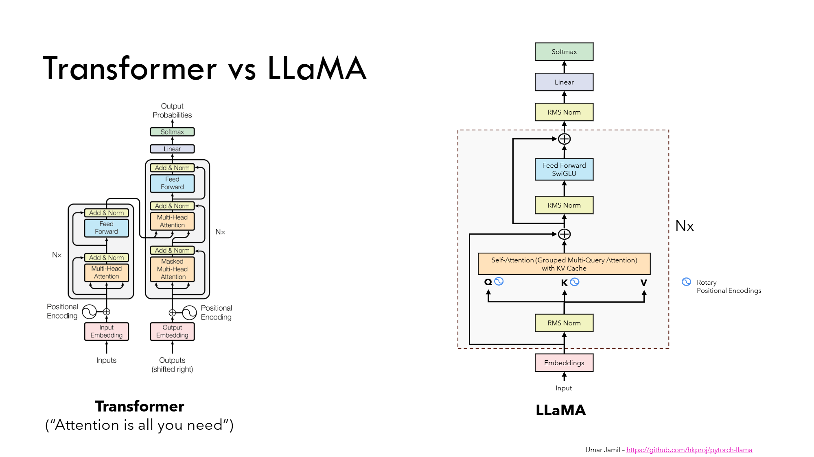

# Model Architecture Overview

At the heart of SimpleLLaMA is the **transformer architecture** — the same family of models that power GPT, LLaMA, and DeepSeek.  
Transformers are flexible neural networks designed to process sequences of data (like text), and they’ve become the standard for large language models.

---

## Big Picture

When you give the model a prompt, like:

`"The cat sat on the mat"`

the pipeline looks like this:  
~  
1. **Tokenization** – Text is broken into tokens (e.g., "The", " cat", " sat", " on", " the", " mat").  
2. **Embeddings** – Each token is turned into a dense vector representation.  
3. **Transformer Blocks** – A stack of repeated layers where the real learning happens:  
   - **Attention** → figures out relationships between tokens.  
   - **Feedforward** → transforms and mixes the information.  
   - **Residuals + Normalization** → stabilize and speed up training.  
4. **Output Projection** – Final layer maps hidden states back to the vocabulary.  
5. **Softmax** – Converts raw scores into probabilities for the next token.  

Should add a reference to Umar! 

---

## Decoder-Only Design

This project uses a **decoder-only transformer**, which means:  
- The model only predicts the *next* token given all tokens before it.  
- It’s autoregressive: it generates text left to right, one token at a time.  
- This design is perfect for language modeling, where the task is “predict what comes next.”

---

## Why Transformers?

Transformers replaced older sequence models (RNNs, LSTMs) because:
- They scale much better with data and compute.  
- Attention allows the model to directly connect distant tokens (e.g., the start and end of a paragraph).  
- Parallelization makes them efficient to train on GPUs.

---

In the following sections, we’ll break the model down into its core components:  
- **Embeddings** – how tokens are represented as vectors.  
- **Attention** – how the model connects words together.  
- **Layer Block** – the repeating unit of the transformer.  
- **Output** – how predictions are made.  
