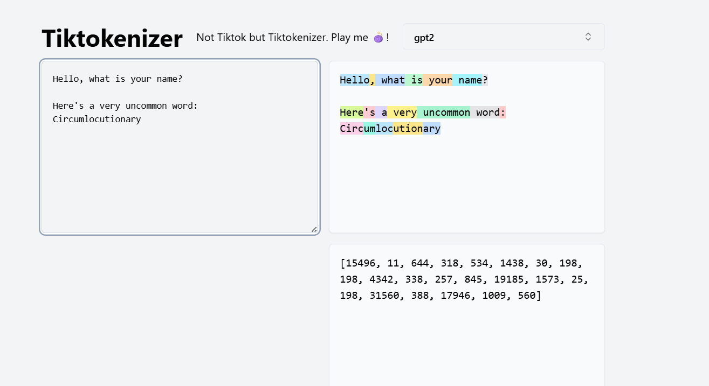

## Tokenization Examples

In this section, we’ll look at some more concrete examples of how tokenization works in practice, and why subword tokenization ends up being the most effective choice for LLMs.

---

### Character-Level Tokenization

Example sentence:  
"Hello, how are you doing today?"

At the character level, this becomes:  
["H","e","l","l","o",","," ","h","o","w"," ","a","r","e"," ","y","o","u"," ","d","o","i","n","g"," ","t","o","d","a","y","?"]

That’s 31 tokens for a short sentence!  

**Pros:**  
- Very simple, no training required.  
- Small vocabulary (if limited to ASCII, just 128 possible tokens).  

**Cons:**  
- Extremely inefficient: every character, space, and punctuation becomes a token.  
- Long sequences mean the model uses much more compute to learn the given text.  
- Context windows get consumed very quickly. Imagine trying to process an entire book one character at a time — it would explode into millions of tokens.  
- Doesn’t scale well to languages with large character sets (Chinese, Korean) where the vocabulary would still be huge and sequences still long.

---

### Word-Level Tokenization

If we instead split on words, we get:  
["Hello", "how", "are", "you", "doing", "today", "?"]

Now it’s only 7 tokens — much shorter than the character-level case.  

**Pros:**  
- Far fewer tokens per sentence.  
- Faster training since each token carries more semantic meaning.  
- Intuitively matches how humans think about words.  

**Cons:**  
- Vocabulary explosion: English alone has 100,000+ words, and that number grows quickly once you consider inflections, misspellings, slang, and technical jargon.  
- Out-of-Vocabulary (OOV) errors: any word not seen during training cannot be encoded at inference. For example, if the word “quantumbotics” appears but wasn’t in the training data, the tokenizer simply has no way to represent it.  
- Poor handling of morphologically rich languages. For example, Turkish or Finnish can produce many forms of a single root word, each of which would need its own token.  
- Non-space-delimited languages (like Chinese or Japanese) are a nightmare for word-level tokenization since there’s no clear way to split words. Tokenizing character-by-character just reverts back to the inefficiency of character-level methods.  

---

### Subword-Level Tokenization

Subword tokenization finds a balance between the two.  
The same sentence could become something like:  
["Hello", ",", " how", " are", " you", " do", "ing", " today", "?"]

Now the length is around 9 tokens — not too long, not too short.  

**Pros:**  
- Vocabulary size is controllable (usually 30k–100k tokens).  
- Can represent any word, even unseen ones, by splitting into smaller known pieces.  
- Captures common roots, prefixes, and suffixes (“walk”, “walking”, “walked” share “walk”).  
- Much more efficient than character-level while avoiding the fragility of word-level.  
- Works across languages, including ones without spaces.  

**Cons:**  
- More complex to train than character- or word-level.  
- Some awkward splits still happen (rare words may be broken down oddly).  
- Token boundaries aren’t always human-intuitive.  

---

### Why Subword Wins

Character-level forces the model to learn spelling and structure from scratch, while word-level makes the vocabulary too large and brittle. Subword-level combines the strengths of both:  
- Compression is strong enough for efficient training.  
- Vocabulary is manageable.  
- Handles unseen or rare words gracefully.  

This is why nearly every modern LLM — GPT, LLaMA, DeepSeek, etc. — uses a subword tokenizer (BPE, Unigram, or a variant) at its core.

---

### Final Notes About BPE

BPE is a simple but highly efficient algorithm for tokenization, but a few additional caveats to be aware of:

1. **Handling non-ASCII characters.**  
   In multilingual settings, non-ASCII characters may cause problems. If the model predicts invalid continuation tokens, you can end up with “garbled” outputs (invalid byte artifacts).

2. **No notion of words.**  
   BPE works purely on frequency of symbol pairs. It doesn’t know about word boundaries, so sometimes splits can be unintuitive. For example:  
   "unhappy" → "un", "hap", "py"  
   While unlikely for very common words, this does illustrate the lack of semantic awareness.

3. **Inefficient for rare words.**  
   Since BPE prioritizes frequent patterns, rare words often get split into many tokens.  
   Example: "Mississippi" → "Mi", "ssi", "ssi", "ppi" (4 tokens for 1 word).  
   Not catastrophic, but inefficient.

4. **Whitespace quirks.**  
   Spaces often get “glued” to words (" dog" instead of "dog"). This is by design, but can look odd.

5. **Static once trained.**  
   Once a BPE tokenizer is trained, its vocabulary is fixed. If new words become common later (say a new slang term or product name), they won’t be merged automatically.

---

For this project, these limitations are minor — but it’s good to be aware of them. Overall, BPE still provides an excellent trade-off and is much better suited for LLMs than raw character- or word-level tokenization.

Here's a great [Tokenization Playground](https://byte-pairing.vercel.app/) to get a more hands-on experience with tokenization  

Here's an example: 

Note how most of the words is a single token, due to their common occurrence in the tokenizer's vocabulary. However once a relatively uncommon word appears, it would be broken down into chunks. 

