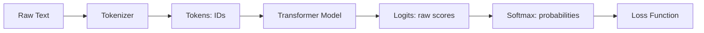
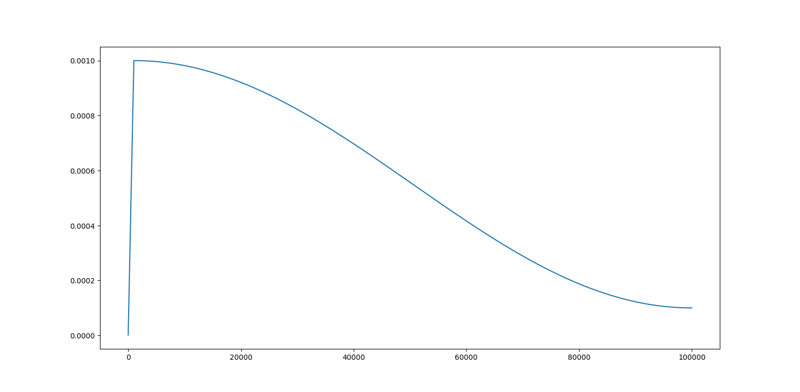
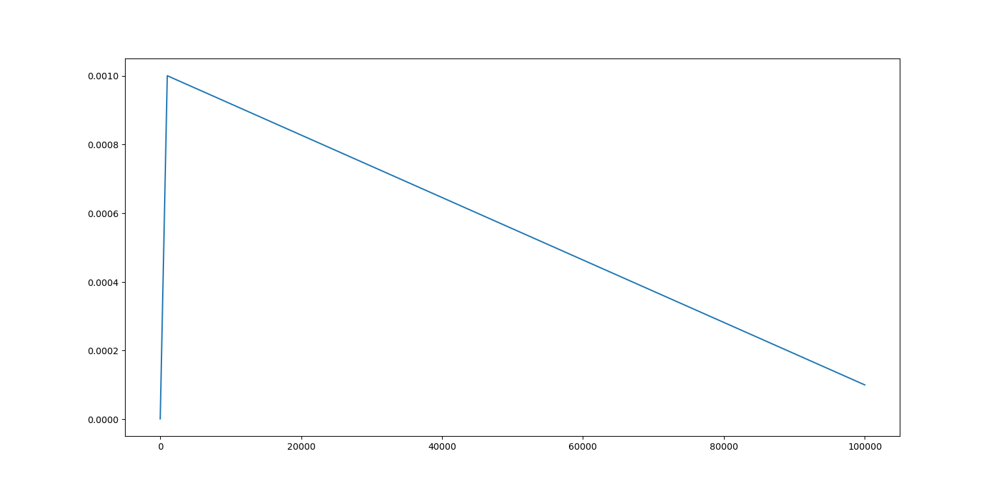
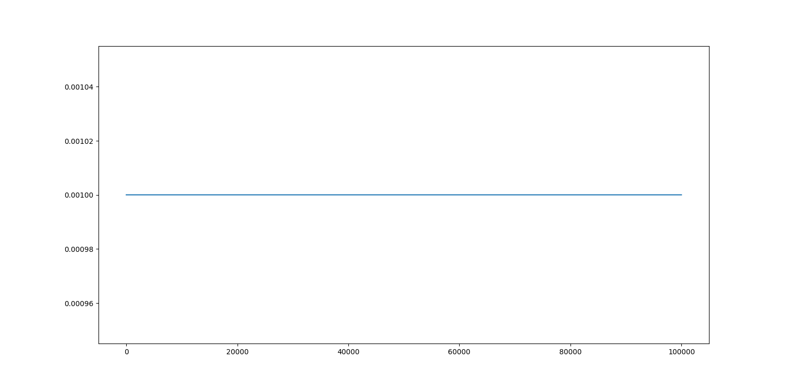

## 1. Introduction: What Are We Doing?

Before we dive into training, let’s step back and ask: **what exactly does it mean to “train a language model”?**

At its core, the goal is very simple:  
**We want the model to learn how to predict the next token in a sequence of text.**

---

### The Idea in Plain English

Imagine you are reading a sentence:

> "The cat sat on the ____"

Even without seeing the last word, your brain automatically guesses it might be *“mat”*, *"couch"*, *"floor"* or any other plausible words. That’s because you’ve learned patterns of how words usually appear together.  

A language model is doing the same thing, but instead of words, it deals with **tokens** (small units of text such as subwords, characters, or whole words depending on the tokenizer).  

During training, the model sees billions of examples of token sequences and learns which token is most likely to come next. Over time, this builds up into a powerful statistical understanding of language.

---

### From Text to Tokens

Computers can’t directly process raw text like `"The cat sat on the mat"`. We first need to break it down into numerical form.

1. **Raw Text:**  
   `"The cat sat on the mat"`

2. **Tokenized Text (IDs):**  
   `[1202, 850, 149, 4211, 769, 1839]`  
   (each number is a token ID from a vocabulary)

3. **Input Tensor (batch of sequences):**  
   ```text
   tensor([[1202,  850,  149, 4211,  769]])
   ```

The vocabulary maps every possible token (like “cat”, “sat”, “on”) to a unique integer. The model only sees these integers.

---

### How the Model Thinks

Now, let’s show the high-level flow of how these tokens are processed:



Let’s break down the important parts:

- **Logits:** The model outputs a vector of raw scores for each possible token in the vocabulary. For example, if the vocab size is 50,000, the logits are a vector of 50,000 numbers. These are *not yet probabilities*.

  - **Softmax:** We apply the softmax function to logits, which turns them into probabilities (values between 0 and 1 that sum to 1). For example, the model might say:
    - “mat”: 0.72  
    - “floor”: 0.12  
    - “couch”: 0.03  
    - … and so on for every other token.  

- **Loss:** The training process compares the predicted probability distribution to the correct answer (the actual next token). It calculates how far off the prediction was. This is the “loss.” The smaller the loss, the better the model is at predicting.

---

### Why This Matters

This “predict the next token” setup is deceptively simple, but it’s powerful. By learning these probabilities across massive amounts of text, the model starts to capture grammar, facts, reasoning, and even world knowledge — all as a side effect of next-token prediction.

So when we say *“train a transformer model,”* what we really mean is:  
- Give the model tons of sequences of tokens.  
- Ask it to guess the next token.  
- Measure how wrong it was.  
- Adjust the model’s weights to improve its guesses.  
- Repeat billions of times.  

That’s the heart of language model training.

---


## 2. Model Configuration

Before we can train our transformer, we need to decide on all the hyperparameters and settings that control both the model and the training process. These settings are stored in a configuration object, which in our case is implemented using a Python dataclass called `TrainingConfig`.  

The configuration file may look intimidating at first, since it lists dozens of parameters. But many of them are straightforward once you understand the categories they fall into. Let’s walk through the most important ones.

---

The first group of parameters defines where the data and outputs are stored. For example:  

- `dataset_dir` tells the program where to find the pre-tokenized dataset files.  
- `tokenizer_path` points to the JSON file that contains the trained tokenizer.  
- `ckpt_dir` specifies the folder where model checkpoints will be saved during training.  
- `log_file` is a simple text file where progress (like loss values) is recorded.  

Together, these ensure the training script knows both where to read the data from and where to save its results.  

---

Next, we have the **batch and sequence length parameters**, which directly control how much data the model processes at once.  

- `batch_size` is the number of sequences per batch. If you set this to 4, then each step processes 4 separate chunks of text in parallel.  
- `max_seq_len` is the maximum number of tokens per sequence. For example, if `max_seq_len = 2048`, then each input sequence is capped at 2048 tokens long. Longer documents must be split into smaller pieces.  
- `tokens_per_update` defines how many tokens are processed before the optimizer takes a step. Since this touches upon gradient accumulation, which is outside the scope of this basic explanation, it will be covered in the `training_advanced.md` file.  

These three parameters together determine how much work the model is doing in each training step and how much GPU memory it will consume.

---

Then comes the **model architecture** itself. These parameters define the shape and capacity of the transformer network:  

- `n_embd` is the embedding dimension, the size of the vector used to represent each token internally. Larger values allow the model to capture richer relationships, but also make it heavier to train.  
- `n_heads` sets how many attention heads are used per layer. Each head can focus on different relationships in the sequence, so more heads allow for more diverse patterns.  
- `n_layers` is the number of stacked decoder layers. Each layer refines the token representations further, so deeper models are generally more powerful.  
- `multiple_of` controls the feedforward layer’s hidden dimension. Instead of choosing an arbitrary number, this ensures the size is a multiple of a fixed value (like 256), which helps optimize matrix multiplications on GPUs.  
- `eps` is a tiny value added in normalization layers to avoid division by zero errors. It’s not something you usually tweak, but it is essential for numerical stability.  
- `theta` sets the base frequency for Rotary Position Embeddings (RoPE), which are used to encode token positions into the model. Again, you typically leave this at its default.  
- `dropout` is a regularization mechanism where some connections are randomly “dropped” during training. For large pretraining, this is often set to `0.0` because the dataset itself provides enough variety, but in smaller-scale experiments you might increase it to avoid overfitting.  

These architecture parameters are the “DNA” of the model. Changing them fundamentally alters the size and behavior of the transformer.

---

Another critical part of the config is the **training schedule**. Training a large language model is not just about choosing an optimizer and running it — we also need to carefully plan how the learning rate evolves over time.  

- `warmup_iterations` specifies how many steps are used to gradually increase the learning rate at the start of training. This prevents the model from diverging early on.  
- `max_lr` is the peak learning rate reached after warmup.  
- `min_lr` is the final learning rate at the end of training, typically reached through a cosine decay schedule.  
- `beta1` and `beta2` are parameters of the AdamW optimizer, which control how much past gradients influence the updates.  
- `weight_decay` is a form of regularization that prevents weights from growing too large, helping the model generalize better.  

Together, these define the “pace” at which the model learns.

---

Finally, we have the **training tokens and evaluation settings**.  

- `training_tokens` is the total number of tokens the model will see during training. For example, `45e9` means 45 billion tokens in total.  
- `eval_interval` controls how often the model’s progress is evaluated. For instance, every 32 steps the model might generate text and log its loss.  
- `model_gen_multiplier` adjusts how frequently sample generations are produced during training.  

The config also includes checkpointing settings such as `token_ckpt` (how often to save the model in terms of tokens processed) and `load_ckpt` (whether to resume from a previous run).

---

Even though this configuration object looks large, most of its parameters can be grouped into four intuitive categories: **paths**, **batching**, **model architecture**, and **training schedule**. For the beginner doc, you don’t need to memorize every single field — the important thing is to understand what each group does. The rest can be treated as implementation details that you return to once you start experimenting.


## 3. Dataset & Batching

In the introduction, we explained that the goal of training is for the model to learn how to predict the next token in a sequence. But how do we actually present this information to the model during training? 

This is where the **Dataset Loader** comes in. Its job is to take the large tokenized dataset stored on disk and feed the model with manageable “mini-batches” of tokens at every training step. Without this loader, we would have no practical way to handle billions of tokens, because we cannot load everything into memory or train on an endless stream of raw text.  

When training a language model, we usually start with a massive corpus of text — sometimes hundreds of gigabytes. This raw text has already been **tokenized** and stored in NumPy arrays for efficiency. These files are then fed into the Dataset Loader.

If you tried to feed the entire dataset into the model in one go, three things would immediately go wrong:  
1. The model would run out of memory, because GPUs cannot hold billions of tokens at once.  
2. Training would be extremely inefficient, since we want to update weights frequently rather than waiting for one giant pass.  
3. We would lose the ability to shuffle, divide across GPUs, or checkpoint easily.  

The Dataset Loader solves all of these problems by breaking the token stream into smaller, more manageable pieces. At each step, it delivers a **batch** of sequences — small slices of the dataset that the model can process in parallel.

---

### The Structure of `(x, y)`

Each batch returned by the loader consists of two tensors:  

- `x`: The input sequences of tokens.  
- `y`: The same sequences, shifted one position to the right.  

This shifting mechanism is what allows the model to learn “next token prediction.”  

Let’s walk through a concrete example. Suppose the dataset contains a chunk the following six tokens:  

```
Tokens: [1202, 850, 149, 4211, 769, 1839]
```

If we set `batch = 1` and `seq_len = 5`, then the loader will slice the data like this:  

```
x = [[1202, 850, 149, 4211, 769]]
y = [[ 850, 149, 4211,  769, 1839]]
```

At first glance, this looks like we are simply training a **bigram model** — for every token in `x`, we just predict the token in the same position in `y`. But that’s not really what is happening inside the transformer. The important detail is that the model doesn’t just see the token at position *t* and try to guess token *t+1*. Instead, it sees the **entire sequence up to position t**, and from that context, it tries to guess the next token.

So in this case, the training targets look more like this:  

- Given `[1202]`, predict `850`.  
- Given `[1202, 850]`, predict `149`.  
- Given `[1202, 850, 149]`, predict `4211`.  
- Given `[1202, 850, 149, 4211]`, predict `769`.  
- Given `[1202, 850, 149, 4211, 769]`, predict `1839`.  

Notice the subtle difference. A bigram model would only look at one previous token at a time, while the transformer looks at the **entire history of the sequence** and uses self-attention to weigh the importance of different past tokens when predicting the next one. This is what allows it to capture long-range dependencies in language, like subject–verb agreement across many words.

---

### Code Example with Toy Data

Here is a small code example using the `DatasetLoader` class:

```python
from simple_llama.pretraining.dataset_loader import DatasetLoader

# Small example
loader = DatasetLoader(
    batch=2,           # Number of sequences in a batch
    seq_len=4,         # Number of tokens per sequence
    process_rank=0,    # Single-process case
    num_processes=1,
    dataset_dir="data", 
    device="cpu"
)

x, y = loader.get_batch()
print("x:", x)
print("y:", y)
```

Example output (toy data):

```
x: tensor([[1202,  850,  149, 4211],
           [ 769, 1839, 3521, 4879]])
y: tensor([[ 850,  149, 4211,  769],
           [1839, 3521, 4879, 2035]])
```

Now you can clearly see how the pairs line up. Each row of `x` is a sequence of tokens, and each row of `y` is that same sequence shifted by one token. The model is trained to predict all of those shifts in parallel.

---

### Why Batching Matters

The idea of batching deserves special attention. If we only trained on one sequence at a time, the model would make progress, but it would be extremely slow and would not take advantage of GPU acceleration. By grouping multiple sequences together into a batch, we can exploit the GPU’s ability to perform large matrix multiplications efficiently.

Suppose we use:  
- `batch = 32`  
- `seq_len = 2048`  

In that case, the model processes **65,536 tokens at every step**. This is a massive increase in efficiency compared to processing a single sequence.
This batching strategy is one of the main reasons why modern transformers can be trained at such large scales. It allows us to feed in huge amounts of data per optimization step, stabilize the gradients, and make much faster progress than would otherwise be possible.

The Dataset Loader is therefore the **bridge** between the massive dataset on disk and the mini-batches that the model actually learns from. It provides structure to the training process, ensuring that at every step, the model sees just enough data to make a meaningful update — and then moves on to the next batch.


### Inside the Dataset Loader: How It Works

When you create a `DatasetLoader`, you pass in the batch size, sequence length, dataset directory, and a few distributed training arguments:

```python
class DatasetLoader:
    def __init__(self, batch: int, seq_len: int, process_rank: int, num_processes: int, dataset_dir: str, device: str):
        """
        :param batch: Batch size
        :param seq_len: Max seq len
        :param process_rank: Rank of the process that initializes an instance of this class
        :param num_processes: Total number of processes (World Size)
        :param dataset_dir: Dataset directory
        :param device: "cuda" or "cpu"
        """

        self.batch = batch
        self.seq_len = seq_len
        self.process_rank = process_rank
        self.num_processes = num_processes
        self.device = device

        # Holds all the filepaths
        self.filepaths = sorted([os.path.join(dataset_dir, p) for p in os.listdir(dataset_dir)])

        self.file_data = np.load(self.filepaths[0])
        self.file_idx = 0  # Current file index
        self.tok_idx = batch * seq_len * process_rank  # Current token idx
```

Here’s what happens under the hood in `__init__`:

1. **Instance Attribute:** It sets the instance attributes using the given arguments  
2. **File discovery:** It scans the dataset directory and gathers all `.npy` files (each file stores a large array of token IDs).  
3. **Pointers/Tracker Initialization:**  
        - **`file_data`:** At startup, the loader reads the *first* `.npy` file in the dataset directory into memory. This array contains a long sequence of token IDs.  
        - **`file_idx`:** A counter that starts at `0`, meaning we are currently working with the first file in the dataset. As training progresses and one file is exhausted, this index is incremented to load the next file.  
        - **`tok_idx`:** A pointer into the current file that tells the loader where to start slicing tokens for the next batch. This is critical because each call to `get_batch()` must pick up right where the last one left off.  
        - **Multi-GPU offset:** If using multiple GPUs (distributed training), each process is assigned a different starting offset for `tok_idx`. This prevents all GPUs from training on the exact same data, ensuring better utilization of the dataset.  
    

Together, these three trackers (`file_data`, `file_idx`, `tok_idx`) allow the loader to move seamlessly through massive token arrays spread across multiple files, while keeping every batch aligned and avoiding duplication across processes.

---

#### Getting a Batch

The heart of the class is `get_batch()`. This is the function called during training to get new `(x, y)` tensors.

1. **Slice out a chunk of tokens:**  

    ```python
    batch = self.file_data[self.tok_idx : self.tok_idx + (self.batch * self.seq_len) + 1]
    ```
    
    Here we grab just enough tokens for a full batch (`batch * seq_len`) plus one extra, since `y` is shifted.

2. **Reshape into 2D arrays:**  

    ```python
    x = batch[:-1].reshape(self.batch, self.seq_len)
    y = batch[1:].reshape(self.batch, self.seq_len)
    ```
    
    This step converts the flat token slice into two matrices:  
    - `x` for the inputs,  
    - `y` for the targets, shifted by one token.

3. **Advance the token index:**  

    ```python
    self.tok_idx += (self.batch * self.seq_len * self.num_processes)  # Increment the index counter
   
    # If we reach the end of file, move on to the next one
    if self.tok_idx + (self.batch * self.seq_len * self.num_processes) + 1 >= len(self.file_data):
        self.file_idx += 1
        if self.file_idx >= len(self.filepaths):
            self.file_idx = 0
    
        self.file_data = np.load(self.filepaths[self.file_idx])
        self.tok_idx = self.batch * self.seq_len * self.process_rank
    ```
    
    After returning a batch, the loader moves its pointer forward. If we reach the end of a file, it automatically loads the next one and update corresponding counters accordingly. 

4. **Convert to tensors:**  
    
    ```python
    return torch.from_numpy(x.astype(np.int32)).long().to(self.device), torch.from_numpy(y.astype(np.int32)).long().to(self.device)
    ```
    
    The NumPy arrays are cast to `torch.long` (integer type needed for embeddings) and moved to the correct device (CPU or GPU).

---

#### Why This Design?

Overall, the Dataset Loader is designed for training efficiency:

- **Streaming from disk:** It only loads one dataset file at a time, so memory usage stays low.  
- **Batch alignment:** It guarantees that `(x, y)` line up perfectly for next-token prediction.  
- **Distributed training friendly:** The `process_rank` and `num_processes` arguments make sure multiple GPUs can work on different slices of the dataset without overlap.  
- **Scalable:** As long as your dataset is tokenized into `.npy` files, this loader can handle billions of tokens just as easily as thousands.  

One can think of it as a neat wrapper around:  
- slicing arrays,  
- reshaping them into `(batch, seq_len)` form,  
- shifting by one token, and  
- handing them to PyTorch.

This simplicity makes it both easy to understand and powerful enough for large-scale training.


## 4. Learning Rate Scheduler

The learning rate (LR) is one of the most important hyperparameters in training deep neural networks. Too high, and training diverges; too low, and learning stalls. A **scheduler** adjusts the learning rate dynamically during training, instead of keeping it fixed.

This project includes a custom `Scheduler` class that implements warmup and three different scheduling strategies: **cosine decay**, **linear decay**, and **constant LR**.

---

### Why Use a Scheduler?

Schedulers help address two common issues in optimization:

- **Exploding/vanishing gradients** – keeping the LR too high/low throughout training often leads to instability or poor convergence.  
- **Training dynamics** – a model often benefits from a short *warmup* phase (slowly ramping LR up), followed by a gradual *decay* to smaller values.  
- **Generalization** – decaying the LR near the end of training often improves final accuracy/perplexity.

Instead of manually adjusting LR mid-training, a scheduler automates the process.

---

### Scheduler Implementation

The `Scheduler` class wraps around a PyTorch optimizer. It is initialized with a few key parameters:

```python
class Scheduler:
    def __init__(self, torch_optimizer: Optimizer, schedule: str, training_steps: int,
                 warmup_steps: int, max_lr: float, min_lr: float):
        # schedule ∈ ["cosine", "linear", "constant"]
        # training_steps = total number of steps
        # warmup_steps = steps spent ramping LR up
        # max_lr = peak LR
        # min_lr = final LR (ignored for "constant")
```

- **schedule**: strategy ("cosine", "linear", or "constant").  
- **training_steps**: total steps in training run.  
- **warmup_steps**: number of warmup steps (linear ramp up).  
- **max_lr**: highest LR used during training.  
- **min_lr**: final LR (for decay-based schedules).  

---

#### Warmup

During warmup, LR increases linearly from near zero to `max_lr`:

```python
def _update_warmup(self, current_step: int):
    lr = (max(1, current_step) / self.warmup_steps) * self.max_lr
    for param_group in self.optimizer.param_groups:
        param_group['lr'] = lr
    return lr
```

This prevents unstable updates at the beginning of training.

---

#### Cosine Decay

Cosine decay smoothly lowers the LR from `max_lr` to `min_lr`:

```python
def _update_cosine(self, current_step: int):
    current_step -= self.warmup_steps
    scale = (current_step / self.decay_steps) * math.pi
    lr = self.min_lr + 0.5 * (self.max_lr - self.min_lr) * (1 + math.cos(scale))
    for param_group in self.optimizer.param_groups:
        param_group['lr'] = lr
    return lr
```

This schedule is popular in modern LLM training because it decays aggressively at first, then flattens out.

---

#### Linear Decay

Linear decay reduces LR steadily over time:

```python
def _update_linear(self, current_step: int):
    current_step -= self.warmup_steps
    lr = self.max_lr - (current_step / self.decay_steps) * (self.max_lr - self.min_lr)
    for param_group in self.optimizer.param_groups:
        param_group['lr'] = lr
    return lr
```

Simpler than cosine, but still effective.

---

#### Constant

Sometimes you may want to keep LR fixed at `max_lr` (e.g., for debugging).

```python
if schedule == "constant":
    for param_group in self.optimizer.param_groups:
        param_group['lr'] = max_lr
```

---

#### Step Method

The central logic is in the `step` method, which updates LR depending on the phase of training:

```python
def step(self, current_step: int):
    if current_step < self.warmup_steps and self.schedule != "constant":
        self.current_lr = self._update_warmup(current_step)
        return

    if self.schedule == "cosine":
        self.current_lr = self._update_cosine(current_step)
    elif self.schedule == "linear":
        self.current_lr = self._update_linear(current_step)
    elif self.schedule == "constant":
        self.current_lr = self.max_lr
```

This ensures the correct schedule is applied at every step.

---

### Visualizing the Schedules

To make things concrete, below are plots showing how the LR evolves across steps:
(All are 100k total steps, 1k of which is warmup steps, max_lr set to 1e-3 and min_lr set to 1e-4)

**Cosine with Warmup:**



**Linear with Warmup:**



**Constant LR:**



You can generate these plots using the included test script in the class (`__main__` block).

---

### Summary

- **Warmup** prevents instability at the start of training.  
- **Cosine decay** → smooth, effective, widely used in LLMs.  
- **Linear decay** → simpler, still works well.  
- **Constant** → mostly for experiments/debugging.  

This custom scheduler is flexible, checkpointable, and provides good control for projects like this.


## 5. Training Loop

Training a large language model (LLM), even a small‑scale one like in this project, comes down to a repeated cycle: take a batch of data, run it through the model, calculate how wrong the predictions are, push the error backwards to update the weights, and repeat. This cycle is what we call the **training loop**. This section will walk in great detail through the core parts of the loop. 

---

### Instantiation

Before we can train the model, we need to set up all the core building blocks. Once everything is in place, the training loop itself becomes a straightforward repetition of forward pass, loss calculation, backward pass, and optimization.

---

**1. Configuration Object**

The first thing we need is a configuration object that stores all of our hyperparameters. Instead of scattering values like batch size, learning rate, and number of layers across different files, it’s cleaner to place them in a single object or namespace. This makes the code easier to manage, debug, and extend.  

In this project, it will be the `TrainingConfig` class, located within the `simple_llama/pretraining` folder

```python
@dataclass
class TrainingConfig:
    # === Paths and Dataset ===
    dataset_dir: str = root_path("simple_llama", "dataset", "short")       # Path to tokenized training data
    tokenizer_path: str = root_path("simple_llama", "dataset", "bpe_8k.json")          # Path to tokenizer model
    ckpt_dir: str = root_path("simple_llama", "pretraining", "checkpoints")   # Directory to store checkpoints
    log_file: str = root_path("simple_llama", "pretraining", "training_progress.txt")  # File to log training progress

    # === Batch & Sequence ===
    batch_size: int = 4             # Minibatch size
    max_seq_len: int = 2048         # Maximum sequence length per sample
    tokens_per_update: int = 2**19  # ~512K tokens per optimizer update

    # === Model Architecture ===
    n_embd: int = 2048               # Embedding dimension
    n_heads: int = 32                # Number of attention heads
    n_layers: int = 24               # Number of transformer layers
    multiple_of: int = 256           # Feedforward dim multiple for efficient matmul
    eps: float = 1e-5                # Epsilon value to prevent div-by-zero in normalization layers
    theta: int = 10_000              # Theta for RoPE rotation frequency
    dropout: float = 0.0             # Dropout rate; typically 0.0 for pretraining

    ...  # And many more

config = TrainingConfig()
```

This way, if we want to adjust `n_heads` or experiment with a different `max_lr`, it’s a single line change.

---

**2. Dataset Loader**

Next, instantiate a dataset loader object that is defined, passing in hyperparameters as needed, extracted from the configuration object:

```python
from simple_llama.pretraining.dataset_loader import DatasetLoader

dataset_loader = DatasetLoader(batch=batch_size, seq_len=max_seq_len, process_rank=ddp_rank,
                               num_processes=ddp_world_size, dataset_dir=config.dataset_dir, device=device)
```

---

**3. The Model**

Now comes the centerpiece: the transformer model itself. In this project, we’ve implemented `LLaMaTransformer`, which includes embeddings, attention blocks, feedforward layers, normalization, and output projection.

```python
model = LLaMaTransformer(config, tokenizer, device="cuda")
```

Here:  
- `config` gives the model hyperparameters.  
- `tokenizer` provides the vocabulary size.  
- `device="cuda"` places the model on GPU.

Initially, the model’s parameters are random. Training gradually adjusts them so that token predictions become more accurate.

---

**4. The Loss Function**

Next, we define how the model will be judged. For language modeling, the go-to choice is **cross-entropy loss**:

```python
criterion = torch.nn.CrossEntropyLoss()
```

Cross-entropy measures how “surprised” the model is by the correct next token.  
- If the model assigns high probability → low loss.  
- If it assigns low probability → high loss.

---

**5. The Optimizer**

Finally, we define the optimizer. We use **AdamW**, which is the de facto standard for transformers because it combines Adam’s adaptive gradient updates with weight decay for stability.

```python
optimizer = torch.optim.AdamW(model.parameters(), lr=max_lr, betas=(beta1, beta2), weight_decay=weight_decay, **extra_args)
```

This way, every training step will use the optimizer to update the model parameters and the scheduler to adjust the learning rate.


---

**6. Learning Rate Scheduler**

Before we instantiate the optimizer, we actually define the **learning rate scheduler**. The scheduler controls how the learning rate evolves over time, which is critical for stable training.

We’re using the custom `Scheduler` class implemented earlier, which supports *linear decay*, *cosine decay*, or just a *constant* learning rate.

```python
scheduler = Scheduler(torch_optimizer=optimizer,
                      schedule="cosine",
                      training_steps=optimization_steps,
                      warmup_steps=warmup_iterations,
                      max_lr=max_lr,
                      min_lr=min_lr)
```

At this stage, the `torch_optimizer` is left as `None` — we’ll link it once the optimizer is created. This flexibility makes it easy to checkpoint and resume training.

---

At this point, we’ve instantiated:
- The configuration object
- The dataset loader
- The transformer model
- The loss function
- The optimizer
- The learning rate scheduler

All the main components are ready. The next step is to actually run them inside the training loop.

---

### The Model Forward Pass

We begin with a batch of input tokens, grabbed from the DatasetLoader object via the `get_batch()` method. Each integer corresponds to a token ID from our vocabulary.  

Let’s say our batch size is `B = 4`, and the sequence length we train on is `T = 16`. A batch from the dataset loader might look like:

```
x.shape = (B, T) = (4, 16)
```

So `x` is a 2D tensor of integers. Each row is one training example (one text sequence), and each entry is a token ID.  

When we feed this into the model:

```python
logits = model(x)
```

the transformer runs all of its layers: embedding lookup, multiple decoder blocks, attention, feedforward layers, normalization, and finally a linear projection back to vocabulary size.  

The key here is the shape change:  

- Input: `(B, T)` — integers.  
- Output: `(B, T, C)` — floats, where `C` is the vocabulary size.  

Why `(B, T, C)`? Because for every position in every sequence, the model outputs a vector of size `C`, which are the raw unnormalized scores for each possible token in the vocabulary. These are called **logits**.

---

### The Loss Function

Once we have logits, we want to measure how good the predictions are. That is the role of the **loss function**. For language modeling, the standard is **cross entropy loss**.

The goal is simple: the model is asked to predict the next token in the sequence. If the input sequence is `[The, cat, sat, on, the]`, the correct output is `[cat, sat, on, the, mat]`. Each token should map to the next token.  

Cross entropy measures how “surprised” the model is by the correct answer. If the model already places high probability on the true next token, the loss is small. If the model thought another token was much more likely, the loss is large.  

In PyTorch, we use:

```python
criterion = nn.CrossEntropyLoss()
```

However, `CrossEntropyLoss` expects inputs of shape `(N, C)` where `N` is the number of items and `C` is the number of classes, and targets of shape `(N,)`.  

Our logits are `(B, T, C)` and our targets are `(B, T)`. So we flatten them:

```python
loss = criterion(logits.view(-1, C), targets.view(-1))
```

This reshapes:

- `logits.view(-1, C)` → `(B*T, C)`  
- `targets.view(-1)` → `(B*T,)`  

Effectively, we treat the whole batch as one big list of token predictions.

Mathematically, cross entropy loss is:

```
L = - (1/N) * Σ log(softmax(logits)[i, y_i])
```

where `y_i` is the true class (the correct next token).  

More details will be covered in the Advanced Training page

---

### The Backward Pass

Now comes the critical part: telling the model how wrong it was. This is done with:

```python
loss.backward()
```

This triggers PyTorch’s **autograd engine**, which walks backwards through the computational graph.  

Every tensor operation in PyTorch (matrix multiplies, nonlinearities, normalizations) records how it was computed. During `.backward()`, PyTorch applies the chain rule of calculus to compute gradients of the loss with respect to every parameter in the model.

So, if our model has parameters θ = {W1, W2, …}, then after `loss.backward()` we now have stored gradients ∂L/∂W for each parameter. These gradients are stored in each parameter tensor within the `.grad` attribute, which is a matrix of gradients the shape as the weight matrix. 

These gradients tell us: “If you nudge this weight slightly, the loss would go up/down this much.” They are the signals that will guide weight updates.

---

### The Optimizer Step

With gradients calculated, we actually update the weights. This is the job of the optimizer.  

In this project, we use **AdamW**:

```python
optimizer = torch.optim.AdamW(model.parameters(), lr=learning_rate)
```

AdamW is a variant of stochastic gradient descent that adapts learning rates per parameter and includes proper weight decay. It’s widely used in training transformers.

The update cycle is:

```python
optimizer.zero_grad()  # reset gradients to zero

# Between these two steps, perform forward pass, calculate loss, back propagation

optimizer.step()       # update parameters using gradients
```

Why zero gradients? Because PyTorch accumulates gradients by default. If we didn’t zero them, gradients from multiple steps would pile up.

So the full cycle is:

1. Zero gradients → prepare for next step.
2. Forward pass → compute logits and loss.
3. Loss calculation → use criterion to calculate loss.
4. Backward pass → compute gradients.  
5. Optimizer step → update weights.  

---

### A Minimal Training Loop

Putting everything together:

```python
for step in range(num_steps):
    # Get a batch
    x, y = dataset_loader.get_batch()   # x: (B, T), y: (B, T)

    # Forward pass
    logits = model(x)                   # (B, T, C)

    # Compute loss
    loss = criterion(logits.view(-1, C), y.view(-1))

    # Backward pass
    optimizer.zero_grad()
    loss.backward()

    # Update
    optimizer.step()

    if step % 100 == 0:
        print(f"Step {step}, Loss: {loss.item():.4f}")
```

Granted the actual implementation in `simple_llama.pretraining.train` file is much more complex, however this is the backbone of training. Every sophisticated training pipeline — from GPT to LLaMA — reduces to these few lines.  


---

### Evaluation and Monitoring

Training is only half the story. We need to know if the model is improving. The simplest way is to track the **training loss**. Over time, as the model sees more data, loss should decrease, which means the model is getting progressively better at predicting the next token, given an input sequence of tokens.

At the very beginning, before the model has learned anything meaningful, predictions are essentially random. In this case, the expected loss can be approximated by the natural logarithm of the vocabulary size, since each token is equally likely under a uniform distribution.  

For our project, the vocabulary size is 8192. So if the predictions were truly uniform, the expected initial loss would be:

```
ln(8192) ≈ 9.01
```

However, in practice, most parameters in the model (such as linear layers) are initialized from Gaussian distributions using Kaiming or Xavier initialization. This breaks the perfect uniformity and introduces biases. As a result, the observed loss at the very start of training may be slightly higher than the theoretical value — for example, around 9.2 or 9.3 instead of exactly 9.01.  

---

**Why the log of vocab size? (Derivation)**

Cross-Entropy Loss (CEL) is essentially a Negative Log Likelihood (NLL) loss. For a dataset of size `N` with true labels `y_i` and predicted probabilities `p(y_i)`:

```
CEL = - (1/N) * Σ log(p(y_i))
```

For a single example where the true class is `c`:

```
CEL = - log(p(c))
```

If the model predicts uniformly over all `V` classes, then `p(c) = 1/V`. Plugging this in:

```
CEL = - log(1/V)
    = log(V)
```

So under uniform predictions, the expected loss equals the log of vocabulary size.

Example:  
- `V = 8192`  
- `CEL = log(8192)`  
- `CEL ≈ 9.01`  

This is the theoretical baseline for random guessing. In practice, initialization bias may push it to ~9.3 at step 0.

---

**Training Dynamics**

As training continues, the loss should decrease steadily. For instance, a drop from ~9.3 to ~3 or ~2 means the model is learning meaningful statistical patterns in the data. Lower loss translates directly into the model being less “surprised” when predicting the next token.

Think of it this way:  
- At loss ≈ 9, the model is basically clueless, assigning ~1/8192 probability to every token.  
- At loss ≈ 3, the model assigns ~1/20 probability to the correct token on average.  
- At loss ≈ 1, the model is strongly confident, giving ~1/3 probability to the correct token.

Even at a loss of around 3.0, the probabiliy assignment is at ~1/20. That may sound low if one interpret it as "The model only have a 5% chance of choosing the correct token, for a given sequence"
However that is a bit misleading. In English (or just about all languages) there is natural entropy to it. Vast majority of the time, there are multiple valid answers to a given sequence.  

Taking the previous example, we give the model: `[The, cat, sat, on, the]` and want it to predict the next token. Our true label should be the token corresponding to the word `mat` however, in general, there isn't just a single right-wrong answer. 
Words like `floor`, `ground`, `couch` and such are also completely valid. Hence a probability of 1/20 chance choosing the 'correct' token isn't as bad a it may numerically seem to be. 

---

**Validation?**

It’s also common to periodically **evaluate** on a held-out validation set. This prevents overfitting, since training loss always decreases but validation loss may rise if the model memorizes.  

However, in this project, no validation set is used. Why? Because the dataset (50B tokens gathered from FineWebEdu) is completely unique. Training is done in a single epoch — the model will only see each token sequence once. Under this regime, overfitting is theoretically impossible.  

In fact, if a model with ~1B parameters *were* able to fully overfit on 50B unique tokens, that would be remarkable — it would essentially mean the model is acting as a form of near-lossless compression of the dataset. From that perspective, it might even be considered desirable. But in practice, that's nearly impossible. Here we will only go through one pass using the 50B tokens, simply track training loss as the main signal of progress.

---

### A Tiny Generation Example

Even early in training, it’s fun (and useful) to test the model by generating text.  

We take a prompt, tokenize it, and call a generate function:

```python
print(model.generate("Once upon a time", max_new_tokens=20))
```

At the start, the output will be nonsense — the model has learned almost nothing. But as loss decreases, generated samples gradually improve. They start forming grammatical sentences, then coherent paragraphs.

This qualitative check is as important as loss curves, because it directly shows what the model is learning.

---

### Bringing It All Together

To summarize, each training step does:

1. Take a batch `(B, T)` of token IDs.  
2. Run through model → get logits `(B, T, C)`.  
3. Compute cross entropy loss with targets `(B, T)`.  
4. Backpropagate loss → compute gradients.  
5. Optimizer updates weights.  
6. Zero gradients.  

This loop runs millions of times. At small scale, it might be just tens of thousands of steps. At large scale (GPT‑3, LLaMA), training can take trillions of tokens.

But the essence is always the same. The beauty of the transformer is that all of this complexity — embeddings, attention, normalization, feedforward layers — reduces down to the training loop you’ve just seen.

---


