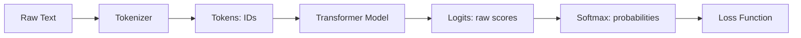

## Introduction: What Are We Doing?

Before we dive into training, let’s step back and ask: **what exactly does it mean to “train a language model”?**

At its core, the goal is very simple:  
**We want the model to learn how to predict the next token in a sequence of text.**

---

### The Idea in Plain English

Imagine you are reading a sentence:

> "The cat sat on the ____"

Even without seeing the last word, your brain automatically guesses it might be *“mat”*, *"couch"*, *"floor"* or any other plausible words. That’s because you’ve learned patterns of how words usually appear together.  

A language model is doing the same thing, but instead of words, it deals with **tokens** (small units of text such as subwords, characters, or whole words depending on the tokenizer).  

During training, the model sees billions of examples of token sequences and learns which token is most likely to come next. Over time, this builds up into a powerful statistical understanding of language.

---

### From Text to Tokens

Computers can’t directly process raw text like `"The cat sat on the mat"`. We first need to break it down into numerical form.

1. **Raw Text:**  
   `"The cat sat on the mat"`

2. **Tokenized Text (IDs):**  
   `[1202, 850, 149, 4211, 769, 1839]`  
   (each number is a token ID from a vocabulary)

3. **Input Tensor (batch of sequences):**  
   ```text
   tensor([[1202,  850,  149, 4211,  769]])
   ```

The vocabulary maps every possible token (like “cat”, “sat”, “on”) to a unique integer. The model only sees these integers.

---

### How the Model Thinks

Now, let’s show the high-level flow of how these tokens are processed:



Breaking down the important parts:

- **Logits:** The model outputs a vector of raw scores for each possible token in the vocabulary. For example, if the vocab size is 50,000, the logits are a vector of 50,000 numbers. These are *not yet probabilities*.

  - **Softmax:** We apply the softmax function to logits, which turns them into probabilities (values between 0 and 1 that sum to 1). For example, the model might say:
    - “mat”: 0.72  
    - “floor”: 0.12  
    - “couch”: 0.03  
    - … and so on for every other token.  

- **Loss:** The training process compares the predicted probability distribution to the correct answer (the actual next token). It calculates how far off the prediction was. This is the “loss.” The smaller the loss, the better the model is at predicting.

---

This “predict the next token” setup is deceptively simple, but it’s powerful. By learning these probabilities across massive amounts of text, the model starts to capture grammar, facts, reasoning, and even world knowledge — all as a side effect of next-token prediction.

So when we say *“train a transformer model,”* what we really mean is:  

- Give the model tons of sequences of tokens.  
- Ask it to guess the next token.  
- Measure how wrong it was.  
- Adjust the model’s weights to improve its guesses.  
- Repeat billions of times.  

That’s the heart of language model training.
